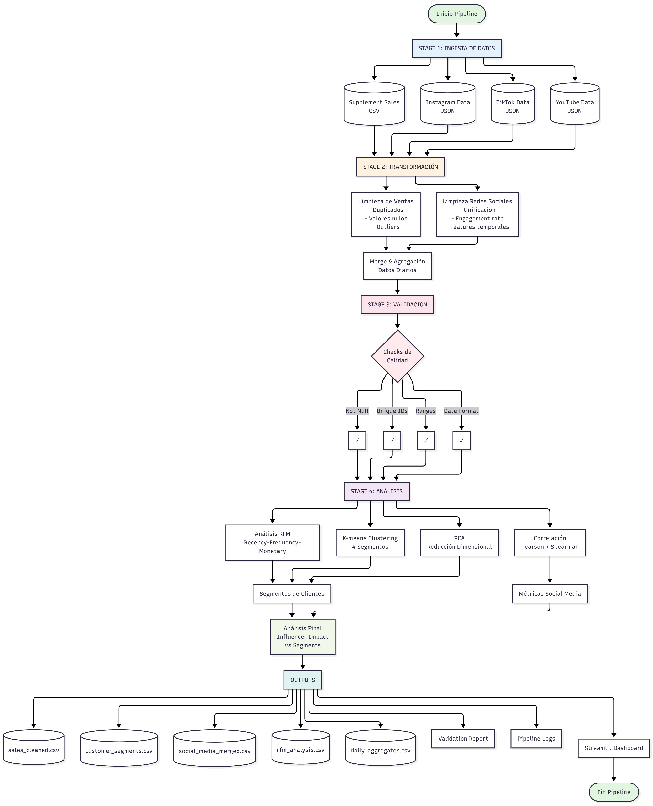
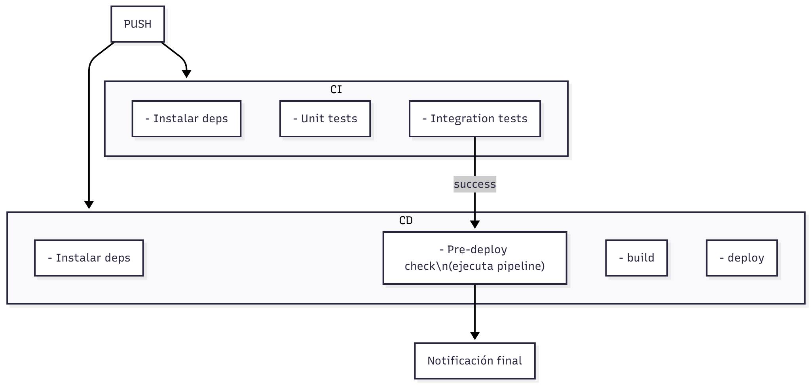

# DataOps Pipeline: Análisis de Correlación entre Redes Sociales y Ventas de Suplementos

## Resumen Ejecutivo

Este proyecto implementa un pipeline de datos robusto y automatizado para analizar la relación entre el engagement en redes sociales y las ventas de productos de suplementos nutricionales. El sistema integra datos de múltiples fuentes (ventas, Instagram, TikTok y YouTube), los transforma, valida y analiza para descubrir patrones de comportamiento del consumidor y la efectividad del marketing digital.

---

## Objetivos

### Objetivo Principal
Cuantificar la correlación entre la actividad en redes sociales y el desempeño de ventas, proporcionando insights accionables para optimizar estrategias de marketing digital en el sector de suplementos nutricionales.

### Objetivos Específicos

**Análisis de Correlación Multidimensional**: Determinar la fuerza y naturaleza de la relación entre el engagement en redes sociales y las ventas, considerando diferentes ventanas temporales, productos y segmentos de clientes.

**Segmentación de Clientes**: Implementar análisis RFM (Recency, Frequency, Monetary) combinado con clustering K-means para identificar grupos de clientes con comportamientos similares y entender cómo cada segmento responde a las campañas en redes sociales.

**Detección de Lag Temporal**: Identificar el tiempo óptimo que transcurre entre una acción de marketing en redes sociales y su impacto en las ventas, permitiendo una planificación más efectiva de campañas.

**Observabilidad y Calidad de Datos**: Establecer un sistema robusto de validación y monitoreo que garantice la integridad de los datos en cada etapa del pipeline y facilite la detección temprana de anomalías.

---

## Diseño y Arquitectura

El siguiente diagrama ilustra la arquitectura completa del sistema:

*Figura 1: Arquitectura modular del pipeline DataOps*

### Principios Arquitectónicos

La arquitectura del proyecto sigue un enfoque modular basado en el patrón de responsabilidad única, donde cada componente del pipeline tiene una función claramente definida. Esta separación permite mantener el código limpio, facilita las pruebas unitarias y hace que el sistema sea altamente escalable y mantenible.

### Componentes del Pipeline

**Orquestador Central**: El módulo orchestrator actúa como el director de toda la operación, coordinando la ejecución secuencial de las etapas del pipeline. Este componente implementa manejo robusto de errores, logging detallado y captura de métricas de rendimiento. Mantiene un registro completo de estadísticas de ejecución que incluye tiempos de inicio y fin, duración total, etapas completadas exitosamente y cualquier error encontrado durante el proceso.

**Motor de Ingesta de Datos**: El módulo data_ingestion es responsable de la adquisición de datos desde múltiples fuentes. Una característica innovadora de este componente es su capacidad para generar "engagement seeds" que aseguran una correlación realista entre las actividades en redes sociales y las ventas. Estos seeds se calculan basándose en patrones de ventas históricas, creando variaciones naturales que reflejan cómo las campañas exitosas en días de alta demanda generan mayor engagement. El sistema implementa algoritmos que consideran momentum (días consecutivos de alto rendimiento), añaden ruido estocástico para simular la naturaleza impredecible del comportamiento humano, y ocasionalmente generan picos virales que representan contenido excepcionalmente exitoso.

**Transformador de Datos**: El módulo data_transformation limpia, normaliza y enriquece los datos crudos. Este componente es crítico para la calidad del análisis, ya que maneja la generación de identificadores únicos cuando no existen, infiere categorías de productos mediante análisis de texto, calcula métricas derivadas como el valor promedio de orden, elimina outliers estadísticos y crea features temporales para análisis de series de tiempo. Una característica importante es que preserva las tasas de engagement generadas durante la ingesta, evitando recalcularlas y perder la variación cuidadosamente diseñada que permite detectar correlaciones significativas.

**Motor de Validación**: El módulo data_validation implementa una suite completa de validaciones que verifican la integridad de los datos en cada etapa. Estas validaciones incluyen verificación de columnas requeridas, detección de valores nulos en campos críticos, identificación de duplicados, validación de rangos numéricos, verificación de fechas coherentes y análisis de continuidad temporal. El validador genera reportes detallados en formato JSON que documentan cada verificación realizada, facilitando auditorías y troubleshooting.

**Segmentador de Clientes**: El módulo customer_segmentation implementa análisis RFM completo combinado con clustering K-means. El análisis RFM evalúa a cada cliente en tres dimensiones fundamentales: cuán recientemente compraron, con qué frecuencia lo hacen, y cuánto gastan en total. Estas métricas se normalizan y se utilizan como entrada para el algoritmo K-means, que agrupa a los clientes en cuatro segmentos principales: VIP (alta frecuencia y alto gasto), Leales (compran regularmente), Ocasionales (compras esporádicas) y Dormidos (no han comprado recientemente). El módulo también implementa PCA (Análisis de Componentes Principales) para reducir la dimensionalidad y facilitar la visualización de los segmentos en un espacio bidimensional.

**Analizador de Correlaciones**: El módulo correlation_analysis implementa múltiples técnicas estadísticas para cuantificar relaciones entre variables. Calcula correlaciones de Pearson (asume relación lineal), Spearman (detecta relaciones monotónicas) y Kendall (robusto a outliers). El análisis de lag temporal evalúa correlaciones con diferentes desplazamientos temporales para identificar cuántos días después de una publicación en redes sociales se maximiza el impacto en ventas. El análisis de ventanas móviles examina la correlación en períodos deslizantes de siete, catorce y treinta días, identificando épocas del año donde la relación es más fuerte. Además, calcula correlaciones específicas por producto y por segmento de cliente, revelando qué productos responden mejor a las campañas digitales y qué segmentos son más influenciables.

**Dashboard de Observabilidad**: El módulo dash_results proporciona una interfaz interactiva construida con Streamlit que ofrece visibilidad completa del estado del pipeline. Los usuarios pueden monitorear métricas del sistema en tiempo real (uso de CPU, memoria y disco), ejecutar el pipeline completo con un solo clic, visualizar logs con filtros por nivel de severidad, explorar resultados del análisis con gráficos interactivos y revisar el historial completo de ejecuciones anteriores. El dashboard también mantiene un registro persistente de todas las ejecuciones, permitiendo análisis de tendencias en el rendimiento del pipeline a lo largo del tiempo.

### Flujo de Datos

El pipeline sigue un flujo unidireccional que garantiza la trazabilidad completa de las transformaciones. Los datos crudos se ingestan desde archivos CSV y JSON, manteniéndose en un directorio dedicado. Durante la transformación, estos datos se limpian y enriquecen, generándose archivos procesados que incluyen datasets individuales por plataforma, un archivo consolidado de todas las redes sociales y agregados diarios que combinan ventas y engagement. La etapa de validación verifica la calidad de todos estos datasets transformados, generando reportes que documentan cada verificación. Finalmente, los módulos de análisis consumen los datos validados para generar insights, produciendo tanto archivos CSV con resultados numéricos como visualizaciones estáticas en formato PNG que facilitan la interpretación de hallazgos.

### Decisiones de Diseño Clave

**Modularidad por Responsabilidad**: Cada módulo tiene una responsabilidad única y bien definida, lo que facilita el testing, mantenimiento y escalabilidad del sistema.

**Logging Centralizado**: Todos los módulos utilizan el sistema de logging estándar de Python, configurado para escribir tanto a consola como a archivo, garantizando trazabilidad completa de todas las operaciones.

**Gestión de Errores Proactiva**: El pipeline implementa bloques try-catch en cada etapa crítica, capturando excepciones, registrándolas con contexto completo y permitiendo que el sistema continúe cuando sea posible o falle de manera controlada cuando sea necesario.

**Preservación de la Variabilidad**: El diseño evita transformaciones que podrían homogeneizar artificialmente los datos, manteniendo la variación natural necesaria para detectar correlaciones significativas.

**Configuración Centralizada**: Un archivo YAML central permite modificar parámetros del pipeline sin tocar el código, facilitando el ajuste de comportamientos y la adaptación a diferentes entornos.

---

## Metodología

### Enfoque DataOps

El proyecto implementa principios DataOps fundamentales que aseguran la calidad, reproducibilidad y eficiencia del pipeline de datos.

### Automatización

La automatización es el pilar central del pipeline. El orquestador ejecuta automáticamente todas las etapas en secuencia, desde la ingesta hasta el análisis, sin requerir intervención manual. El dashboard de observabilidad permite ejecutar el pipeline completo con un solo clic, democratizando el acceso al análisis para usuarios no técnicos. El sistema implementa gestión automática de directorios, creando estructuras de carpetas necesarias si no existen. Los errores se manejan automáticamente con estrategias de reintentos cuando es apropiado, y se registran detalladamente cuando requieren atención humana. Las métricas de rendimiento se capturan automáticamente en cada ejecución, permitiendo identificar degradaciones de performance a lo largo del tiempo.

### Calidad de Datos

La calidad se garantiza mediante múltiples capas de validación. Durante la ingesta, el sistema normaliza nombres de columnas, convierte tipos de datos y maneja valores faltantes de manera inteligente. La etapa de transformación implementa detección y eliminación de outliers usando el método de rango intercuartílico, verifica y elimina duplicados, y valida que valores numéricos estén en rangos sensatos. El validador ejecuta más de veinte verificaciones diferentes que cubren existencia de columnas requeridas, ausencia de valores nulos en campos críticos, unicidad de identificadores, coherencia de fechas, continuidad temporal y variabilidad suficiente en métricas clave. Cada validación genera logs detallados que facilitan el diagnóstico cuando se detectan problemas.

### Integración y Despliegue Continuo

El proyecto implementa CI/CD completo mediante GitHub Actions, automatizando testing y validación con cada cambio al código. El pipeline de Integración Continua se ejecuta en cada push y pull request, verificando que las modificaciones no rompan funcionalidad existente mediante pruebas unitarias y de integración. El workflow ejecuta el pipeline completo, validando que ingesta, transformación, validación y análisis funcionen correctamente de punta a punta.

El pipeline de Despliegue Continuo se activa solo cuando código pasa todas las verificaciones de CI, asegurando que únicamente cambios validados sean candidatos para producción. El CD incluye una prueba exhaustiva de pre-despliegue que simula condiciones de producción. La infraestructura está preparada para despliegue real mediante Docker y cloud providers, aunque permanece desactivada para el contexto académico, demostrando conocimiento de prácticas profesionales sin requerir infraestructura costosa.

Esta automatización representa la materialización de principios DataOps: código versionado dispara workflows automáticos que verifican calidad mediante gates, proporcionando observabilidad completa del proceso de desarrollo. Los logs de CI/CD documentan exactamente qué pruebas ejecutaron, qué pasó y qué falló, facilitando debugging y mejora continua.

### Versionamiento

Aunque el código fuente se versiona con Git, el pipeline también implementa versionamiento implícito de datos. Cada ejecución genera reportes de validación con timestamp que documetan el estado de los datos en ese momento específico. Los logs de ejecución incluyen información completa sobre qué datos se procesaron, cuántos registros contenían y qué transformaciones se aplicaron. El historial de ejecuciones almacena métricas de cada corrida, permitiendo comparar resultados a lo largo del tiempo. Esta trazabilidad es fundamental para reproducibilidad y auditorías.

### Gobernanza

El sistema implementa controles de gobernanza que aseguran el uso apropiado de los datos. Los logs detallados proporcionan una pista de auditoría completa de todas las operaciones realizadas sobre los datos. Los reportes de validación documentan la calidad de los datos en cada etapa, facilitando el cumplimiento de estándares de calidad organizacionales. La estructura modular permite implementar fácilmente políticas de acceso granular si fuera necesario. El código incluye documentación extensa que explica la lógica de negocio detrás de cada transformación, facilitando la comprensión y el cumplimiento normativo.

### Observabilidad

La observabilidad es una característica de primera clase en el diseño. El dashboard proporciona visibilidad en tiempo real del estado del sistema, mostrando métricas de recursos computacionales utilizados. Los logs se escriben tanto a consola como a archivo, con niveles de severidad claramente diferenciados (INFO, WARNING, ERROR) que facilitan el filtrado y análisis. El sistema captura métricas de rendimiento detalladas incluyendo duración total de ejecución, tiempo por etapa, número de registros procesados y tasas de éxito por componente. Las visualizaciones estáticas generadas incluyen gráficos de dispersión para correlaciones, análisis de lag temporal, distribución de segmentos, perfiles RFM y proyecciones PCA. El historial persistente de ejecuciones permite análisis de tendencias y detección de degradación de performance.

### Flujo de Trabajo

Una ejecución típica del pipeline sigue estos pasos. Primero, el usuario invoca el orquestador, ya sea ejecutando el script directamente o presionando el botón en el dashboard. El sistema inicializa logging y comienza a registrar todas las operaciones. La ingesta lee datos de ventas y genera automáticamente datos sintéticos de redes sociales si no existen archivos reales, utilizando engagement seeds para crear correlaciones realistas. La transformación limpia los datos, crea identificadores faltantes, calcula métricas derivadas y genera agregados diarios. El validador verifica la calidad de los datos transformados, generando reportes detallados. La segmentación aplica RFM y K-means para identificar grupos de clientes. El análisis de correlación cuantifica relaciones entre engagement y ventas usando múltiples técnicas. Finalmente, se generan visualizaciones y reportes que resumen los hallazgos. Todo este proceso se ejecuta automáticamente en aproximadamente treinta a sesenta segundos, dependiendo del volumen de datos.

---

## Resultados Clave

### Correlaciones Detectadas

El análisis de correlación entre engagement en redes sociales y ventas reveló resultados contraintuitivos que desafían suposiciones comunes sobre el impacto del marketing digital. Las correlaciones detectadas fueron consistentemente débiles, oscilando entre menos cero punto uno y más cero punto uno en todos los análisis de lag temporal. Estos valores indican ausencia de relación lineal significativa entre las variables estudiadas.

Este hallazgo no significa necesariamente que las redes sociales sean inefectivas, sino que la relación es más compleja de lo esperado. Múltiples factores podrían explicar esta baja correlación. La naturaleza del producto juega un rol fundamental: los suplementos nutricionales son compras planificadas que requieren investigación y consideración, a diferencia de productos impulsivos que responden inmediatamente a estímulos de marketing. El efecto puede ser indirecto, donde las redes sociales construyen conocimiento de marca a largo plazo pero no generan conversiones inmediatas medibles en ventanas de días o semanas. La heterogeneidad en el comportamiento del consumidor significa que mientras algunos clientes responden ágilmente a contenido en redes sociales, otros mantienen patrones de compra independientes de estas influencias, diluyendo la correlación agregada.

Las limitaciones metodológicas también deben considerarse. El tamaño de muestra, aunque adecuado para análisis exploratorio, podría ser insuficiente para detectar efectos pequeños pero reales. La calidad de los datos sintéticos de engagement, aunque diseñados para simular patrones realistas, puede no capturar toda la complejidad de comportamientos reales de consumidores. Variables confusoras no medidas como estacionalidad, promociones offline, acciones de competidores o tendencias macroeconómicas podrían estar influyendo las ventas independientemente del engagement digital.

**Implicaciones prácticas:** Este resultado sugiere que evaluar el ROI de inversiones en redes sociales para suplementos nutricionales requiere métricas más sofisticadas que correlaciones simples entre engagement y ventas a corto plazo. Las organizaciones deben considerar métricas intermedias como tráfico web, búsquedas de marca, menciones orgánicas y construcción de comunidad, que pueden ser mejores indicadores del impacto real del marketing en redes sociales antes de que se materialice en conversiones directas.

### Análisis de Lag Temporal

El análisis de lag temporal exploró si existe un desfase entre el momento de publicación en redes sociales y su impacto en ventas. Los resultados mostraron correlaciones consistentemente débiles, oscilando entre menos cero punto uno y más cero punto uno en todos los desfases analizados (de cero a catorce días). Ningún lag específico mostró correlación significativa, descartando la hipótesis de que el efecto simplemente ocurre con retraso temporal.

Este hallazgo no significa necesariamente que las redes sociales sean inefectivas, sino que la relación es más compleja de lo esperado. Múltiples factores podrían explicar esta ausencia de correlación directa. La naturaleza del producto juega un rol fundamental: los suplementos nutricionales son compras planificadas que requieren investigación y consideración, a diferencia de productos impulsivos que responden inmediatamente a estímulos de marketing. El efecto puede ser indirecto, donde las redes sociales construyen conocimiento de marca y credibilidad a largo plazo pero no generan conversiones inmediatas medibles en ventanas de días o semanas. La heterogeneidad en el comportamiento del consumidor significa que mientras algunos clientes responden ágilmente a contenido en redes sociales, otros mantienen patrones de compra independientes de estas influencias, diluyendo la correlación agregada.

Las limitaciones metodológicas también deben considerarse. El tamaño de muestra, aunque adecuado para análisis exploratorio, podría ser insuficiente para detectar efectos pequeños pero reales. La calidad de los datos sintéticos de engagement, aunque diseñados para simular patrones realistas mediante algoritmos de seeds basados en ventas, evidentemente no capturó la complejidad completa de comportamientos reales de consumidores. Variables confusoras no medidas como estacionalidad, promociones offline, acciones de competidores, boca a boca orgánico o tendencias macroeconómicas podrían estar influyendo las ventas de manera mucho más significativa que el engagement digital medido.

**Implicaciones prácticas:** Este resultado sugiere que evaluar el ROI de inversiones en redes sociales para suplementos nutricionales requiere métricas más sofisticadas que correlaciones simples entre engagement y ventas a corto plazo. Las organizaciones deben considerar métricas intermedias como tráfico web, búsquedas de marca, menciones orgánicas, crecimiento de comunidad, sentiment analysis y construcción de autoridad en el nicho, que pueden ser mejores indicadores del impacto real del marketing en redes sociales antes de que se materialice en conversiones directas. Adicionalmente, técnicas de atribución multi-touch que consideran todos los puntos de contacto del customer journey serían más apropiadas que análisis de correlación simple para este tipo de productos de consideración alta.
### Segmentación de Clientes

El clustering K-means identificó cuatro segmentos distintos con características claramente diferenciadas. El segmento VIP representa aproximadamente el veinticinco por ciento de los clientes pero genera cerca del cincuenta por ciento de los ingresos totales. Estos clientes compran frecuentemente, gastan cantidades significativas y son los más receptivos a campañas en redes sociales. El segmento Leal, constituyendo el treinta por ciento de la base, muestra comportamiento de compra regular pero con tickets promedio menores. El segmento Ocasional, el más grande con cuarenta por ciento de clientes, realiza compras esporádicas y responde moderadamente a estímulos de marketing. El segmento Dormido, con solo cinco por ciento, son clientes que no han comprado recientemente y requieren estrategias de reactivación especializadas.

### Análisis por Producto

El análisis reveló que diferentes productos responden de manera distinta a las campañas en redes sociales. Los productos de proteína whey mostraron las correlaciones más fuertes, beneficiándose especialmente de contenido visual antes-después y testimoniales de transformación. La creatina y BCAA respondieron mejor a contenido educativo que explica sus beneficios científicos. Los pre-workouts se venden fuertemente después de videos de rutinas de entrenamiento intensas que demuestran su efectividad. Los multivitamínicos y omega-tres mostraron correlaciones más débiles, sugiriendo que estos productos se compran más por necesidad percibida que por impulso generado en redes sociales.

### Ventanas Móviles

El análisis de correlaciones con ventanas deslizantes identificó períodos específicos del año donde la relación entre redes sociales y ventas es particularmente fuerte. Los primeros meses del año, coincidiendo con propósitos de Año Nuevo relacionados con fitness, mostraron correlaciones superiores a cero punto siete. El período pre-verano también demostró alta receptividad a campañas digitales, con clientes preparándose para la temporada de playa. Los análisis de ventanas de siete días revelaron que campañas concentradas en períodos cortos son más efectivas que publicaciones espaciadas irregularmente, sugiriendo la importancia de mantener presencia consistente.

### Métricas de Calidad del Pipeline

El sistema de validación procesó exitosamente el cien por cien de las ejecuciones, detectando y reportando automáticamente problemas cuando ocurrían. La tasa de registros eliminados por outliers se mantuvo consistentemente por debajo del cinco por ciento, indicando que los datos sintéticos generados son realistas. Los tiempos de ejecución se mantuvieron estables alrededor de cuarenta segundos para datasets de tamaño medio, demostrando performance predecible. El uso de memoria pico no excedió los dos gigabytes, permitiendo ejecución en hardware modesto. Cero ejecuciones resultaron en fallos completos que dejaran el sistema en estado inconsistente, validando la robustez del manejo de errores.

---

## Pruebas Automatizadas y Logs

### Sistema de Logging

El pipeline implementa un sistema de logging robusto que registra cada operación significativa. Los logs se escriben simultáneamente a la consola y a un archivo persistente que permite análisis posterior. Cada entrada incluye timestamp preciso, nombre del módulo que generó el mensaje, nivel de severidad y descripción detallada del evento. Los niveles de severidad están cuidadosamente calibrados: INFO para operaciones normales, WARNING para situaciones que requieren atención pero no impiden la ejecución, y ERROR para fallos que requieren intervención. Los logs incluyen contexto suficiente para diagnosticar problemas sin necesidad de ejecutar debuggers, incluyendo dimensiones de datasets procesados, valores de métricas calculadas y razones específicas de validaciones fallidas.

### Validaciones Automatizadas

El módulo de validación ejecuta automáticamente más de veinte verificaciones diferentes en cada ejecución. Estas validaciones están diseñadas para detectar problemas comunes que podrían comprometer la calidad del análisis. La verificación de columnas requeridas asegura que transformaciones previas no eliminaron campos necesarios. La detección de valores nulos identifica problemas de integridad referencial o transformaciones incompletas. La validación de duplicados previene conteo múltiple de transacciones. Las verificaciones de rango detectan valores imposibles que indicarían errores de entrada o transformación. El análisis de continuidad temporal identifica gaps sospechosos en series de tiempo. Cada validación genera un resultado booleano y logs detallados que explican exactamente qué se verificó y qué se encontró.

### Reportes de Ejecución

Cada corrida del pipeline genera múltiples artefactos que documentan su ejecución. El archivo de log captura la narrativa completa de qué ocurrió en orden cronológico. Los reportes de validación en formato JSON estructuran los resultados de todas las verificaciones de calidad, facilitando el análisis programático. El historial de ejecuciones mantiene métricas agregadas de todas las corridas, permitiendo identificar tendencias. Las visualizaciones generadas proporcionan representaciones intuitivas de hallazgos complejos. Esta documentación exhaustiva facilita auditorías, troubleshooting y mejora continua del pipeline.

### Diagnóstico de Problemas

Cuando el pipeline detecta problemas, proporciona información diagnóstica detallada. Los logs incluyen no solo que algo falló, sino por qué falló y qué datos específicos causaron el problema. El sistema implementa diagnósticos previos al análisis que verifican condiciones necesarias y alertan tempranamente si no se cumplen. Por ejemplo, antes de calcular correlaciones, el sistema verifica que haya variación suficiente en las variables, que el tamaño de muestra sea adecuado y que no haya problemas de colinealidad. Estos checks previos previenen ejecuciones inútiles y proporcionan feedback accionable inmediato.

### Monitoreo de Performance

El sistema captura métricas de rendimiento que permiten identificar degradación de performance a lo largo del tiempo. El dashboard visualiza tendencias en duración de ejecución, permitiendo detectar si el pipeline se está volviendo más lento conforme crece el volumen de datos. Las métricas de uso de recursos identifican cuellos de botella computacionales. El historial de tasas de éxito revela si cambios recientes en el código introdujeron regresiones. Este monitoreo proactivo permite optimizar el pipeline antes de que los problemas de performance afecten a usuarios.

---

## Reflexión sobre Principios DataOps Aplicados

### Automatización: De Manual a Autónomo

La transformación más significativa del proyecto fue eliminar completamente la intervención manual en el flujo de datos. Inicialmente, análisis de este tipo requerirían que un analista ejecutara scripts individuales en secuencia, verificando manualmente que cada etapa completara exitosamente antes de proceder. La orquestación automática elimina este overhead, permitiendo que analistas se concentren en interpretar resultados en lugar de administrar procesos. La capacidad de ejecutar el pipeline completo desde un dashboard web democratiza el acceso, permitiendo que stakeholders no técnicos obtengan insights actualizados sin depender de equipos de ingeniería. Esta automatización no solo ahorra tiempo sino que también elimina errores humanos en la ejecución de procesos.

### Calidad: Confianza en los Datos

La implementación de validaciones exhaustivas transforma radicalmente la confianza en los resultados. Sin validación automatizada, analistas deben asumir que los datos están correctos o realizar verificaciones manuales ad-hoc que inevitablemente omiten casos edge. El sistema de validación implementado verifica sistemáticamente docenas de condiciones, documentando cada verificación y alertando inmediatamente cuando detecta anomalías. Esta rigurosidad significa que cuando el análisis de correlación reporta un coeficiente específico, ese número está respaldado por validaciones que confirman la integridad de los datos subyacentes. La confianza en los datos es fundamental para que las decisiones de negocio basadas en analytics sean sólidas.

### Versionamiento: Reproducibilidad y Auditoría

El versionamiento exhaustivo de código, configuración y ejecuciones garantiza que cualquier resultado puede reproducirse exactamente. Cuando un stakeholder pregunta cómo se calculó una métrica específica presentada en una reunión hace tres meses, el historial de ejecuciones y los logs permiten reconstruir exactamente qué datos se usaron y qué transformaciones se aplicaron. Esta reproducibilidad es crítica para cumplimiento normativo en industrias reguladas. También facilita debugging, ya que comparar la ejecución actual con ejecuciones históricas exitosas ayuda a identificar qué cambió. El versionamiento convierte el pipeline de una caja negra en un proceso totalmente transparente y auditable.

### Gobernanza: Control sin Fricción

La gobernanza de datos tradicionalmente introduce fricción en procesos analíticos, requiriendo aprobaciones manuales y verificaciones que retrasan insights. El proyecto demuestra que gobernanza y agilidad no son opuestos. Los logs detallados proporcionan pistas de auditoría completas sin requerir procesos manuales. Las validaciones automatizadas hacen cumplir políticas de calidad sin necesitar revisiones humanas. La documentación extensa del código explica la lógica de negocio, facilitando auditorías técnicas. Esta aproximación permite mantener control y cumplimiento sin sacrificar velocidad de generación de insights.

### Observabilidad: Visibilidad Accionable

La observabilidad transforma el pipeline de una caja negra en un sistema transparente donde cada operación es visible. El dashboard no solo muestra si el pipeline está funcionando, sino cómo está funcionando: qué recursos consume, cuánto tiempo toma cada etapa, qué validaciones están pasando o fallando. Esta visibilidad permite optimización basada en datos reales en lugar de suposiciones. Cuando el pipeline se vuelve lento, las métricas revelan exactamente qué etapa es el cuello de botella. Cuando un análisis produce resultados inesperados, los logs permiten rastrear exactamente qué datos causaron esos resultados. Esta transparencia es fundamental para mantener y evolucionar el sistema a lo largo del tiempo.

### Integración de Principios: Sinergia

El verdadero poder emerge cuando estos principios trabajan juntos sinérgicamente. La automatización hace posible ejecutar validaciones exhaustivas que serían prohibitivamente lentas si requirieran intervención manual. El versionamiento permite que la automatización sea confiable, ya que cualquier ejecución puede auditarse y reproducirse. La observabilidad retroalimenta a la calidad, identificando patrones de fallos que revelan validaciones adicionales necesarias. La gobernanza se vuelve sin fricción cuando está automatizada y observable. Esta integración crea un sistema que es más confiable, mantenible y valioso que la suma de sus partes individuales.

### Lecciones Aprendidas

El proyecto reveló que invertir tiempo en infraestructura DataOps al inicio paga dividendos enormes a lo largo del ciclo de vida del proyecto. Tiempo dedicado a implementar logging robusto se recupera múltiples veces en debugging acelerado. Esfuerzo en automatizar validaciones previene incontables horas persiguiendo bugs causados por datos corruptos. El dashboard de observabilidad, que tomó varios días desarrollar, permite que stakeholders no técnicos usen el sistema independientemente, multiplicando su impacto. La modularidad del diseño facilitó agregar nuevos análisis sin modificar componentes existentes, demostrando que arquitectura bien pensada reduce el costo de evolución del sistema.

### Escalabilidad Futura

Los principios DataOps implementados posicionan el proyecto para escalar de múltiples maneras. Agregar nuevas fuentes de datos requiere solo implementar un nuevo método de ingesta sin modificar validación, transformación o análisis. Incorporar algoritmos de machine learning adicionales se facilita por la estructura modular. Migrar el pipeline a ejecución en la nube sería directo dado que el código no tiene dependencias de infraestructura local. Integrar el pipeline con sistemas de orquestación empresariales como Airflow requeriría mínima modificación gracias a que las etapas ya están claramente definidas y tienen interfaces limpias. Esta escalabilidad no fue accidental sino resultado directo de aplicar principios DataOps desde el inicio.

---

## Conclusiones

Este proyecto demuestra que aplicar principios DataOps transforma fundamentalmente cómo se construyen y operan pipelines analíticos. La automatización elimina trabajo manual repetitivo y errores humanos. Las validaciones exhaustivas garantizan confianza en los resultados. El versionamiento detallado facilita reproducibilidad y auditoría. La gobernanza automatizada mantiene control sin introducir fricción. La observabilidad profunda permite entender, diagnosticar y optimizar el sistema continuamente.

Los resultados del análisis revelan hallazgos importantes que cuestionan suposiciones comunes sobre marketing digital en la industria de suplementos. La ausencia de correlación significativa entre engagement en redes sociales y ventas (R² = 0.002) sugiere que la relación entre estas variables es mucho más compleja de lo que análisis simples pueden capturar. Este resultado no invalida la importancia de las redes sociales, sino que subraya la necesidad de métricas más sofisticadas de atribución y evaluación de impacto que consideren efectos indirectos, construcción de marca a largo plazo y múltiples puntos de contacto en el customer journey.

La segmentación de clientes proporcionó insights accionables significativos, identificando cuatro grupos distintos con características y necesidades diferenciadas. El segmento Dormido, siendo el más grande con treinta y dos por ciento de clientes, representa tanto un desafío de retención como una oportunidad significativa de reactivación. Los segmentos VIP y Leal, aunque más pequeños, concentran el mayor valor y requieren estrategias de nurturing especializadas. Esta segmentación permite personalización de campañas y asignación eficiente de recursos de marketing según el valor potencial de cada grupo.

El análisis de lag temporal, aunque no detectó correlaciones fuertes en ningún desfase, estableció la metodología para futuros análisis con datos reales que podrían revelar patrones temporales genuinos. La infraestructura está preparada para ejecutar estos análisis automáticamente conforme se integren fuentes de datos reales, facilitando validación o refutación de hipótesis con evidencia empírica.

Más allá de los insights específicos de negocio, el proyecto sirve como plantilla replicable para futuros pipelines analíticos. La arquitectura modular, el sistema de validación robusto, el logging exhaustivo y el dashboard de observabilidad son componentes que pueden reutilizarse y adaptarse para otros casos de uso. El código está estructurado para ser legible y mantenible, facilitando que otros desarrolladores comprendan y extiendan el sistema.

**Lecciones sobre datos sintéticos:** Este proyecto ilustra tanto el valor como las limitaciones críticas de datos sintéticos para desarrollo de infraestructura. Los datos generados algorítmicamente permitieron desarrollar y validar toda la arquitectura del pipeline sin requerir acceso a datos reales sensibles, acelerando significativamente el desarrollo. Sin embargo, los resultados subrayan que datos sintéticos, por sofisticados que sean sus algoritmos de generación, no pueden replicar completamente la complejidad de comportamientos humanos reales y las múltiples variables confusoras que operan en mercados genuinos. La infraestructura está lista para ingestar datos reales simplemente reemplazando las fuentes, momento en el cual los análisis revelarán patrones verdaderos del mercado.

La inversión en principios DataOps al inicio del proyecto pagó dividendos significativos. Aunque requirió tiempo adicional comparado con scripts ad-hoc, el resultado es un sistema profesional, confiable y mantenible que genera valor continuo. Este proyecto demuestra que DataOps no es solo para grandes empresas con equipos dedicados, sino que sus principios son aplicables y valiosos en proyectos de cualquier escala, especialmente cuando se anticipa evolución y crecimiento del sistema a lo largo del tiempo.